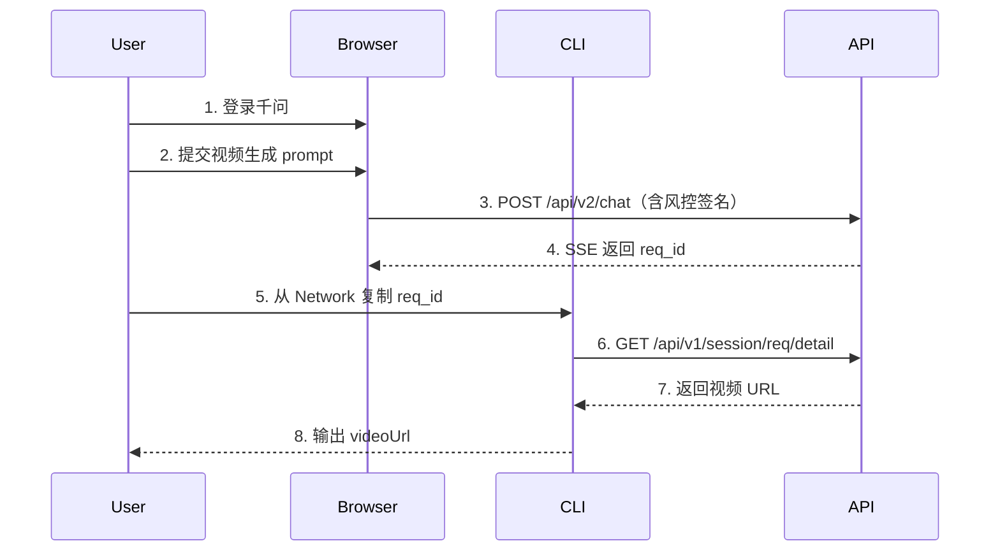

# 千问（通义万相）视频生成 API 逆向记录

> 抓包日期：2026-08-07
> 目标：通过 Cookie 模拟浏览器调用千问免费视频生成接口
> 适配器源码：[src/providers/qwen.ts](../src/providers/qwen.ts)

---

## 一、核心 API 清单

千问视频生成涉及 2 个 API：

| # | API 路径 | 方法 | 用途 | 响应类型 | 风控 |
|---|---------|------|------|---------|------|
| 1 | /api/v2/chat | POST | 提交 prompt，触发视频生成 | SSE 流式 | 需动态签名 |
| 2 | /api/v1/session/req/detail | GET | 轮询会话详情，提取视频 URL | JSON | 仅需 cookie |

**Chat Host**：https://chat2.qianwen.com
**Detail Host**：https://chat2-api.qianwen.com
**前端入口**：https://www.qianwen.com/chat

---

## 二、API 详细参数

### 2.1 chat — 提交生成请求（SSE）

请求：
- POST https://chat2.qianwen.com/api/v2/chat?biz_id=ai_qwen&...
- Content-Type: application/json
- Accept: text/event-stream, application/json, text/plain, */*
- 响应类型：SSE 流式

**URL Query 参数**：
```
biz_id=ai_qwen
fe_version=1.0.0
chat_client=h5
device=pc
fr=pc
pr=qwen
ut={deviceId}
la=zh-CN
tz=Asia/Shanghai
wv=4.1.4
ve=4.1.4
nonce={随机字符串}
timestamp={当前毫秒时间戳}
```

**请求体**（text2video 文生视频）：
```json
{
  "req_id": "852829b06ef6402ca3f3b78615641c9a",
  "parent_req_id": "635f36f506814bd492ac4d6cfebf02ca",
  "messages": [
    {
      "mime_type": "text/plain",
      "content": "生成5秒视频：海浪拍打沙滩",
      "meta_data": { "ori_query": "生成5秒视频：海浪拍打沙滩" },
      "status": "complete"
    }
  ],
  "scene": "chat",
  "sub_scene": "",
  "scene_param": "continue_chat",
  "session_id": "107175ed4a81452192c6e85508b36801",
  "biz_id": "ai_qwen",
  "topic_id": "fA3WHgmnipqbrjSYwNyps4ufNnrZv0g8",
  "model": "Qwen",
  "from": "default",
  "protocol_version": "v2",
  "messages_merge": false,
  "chat_client": "h5",
  "deep_search": null,
  "ai_tool_scene": "zaodian_generate_video",
  "temporary": false,
  "biz_data": "{\"req\":{\"rootModel\":\"wan27\",\"prompt\":\"生成5秒视频：海浪拍打沙滩\",\"originPrompt\":\"生成5秒视频：海浪拍打沙滩\",\"genMode\":\"t2v\",\"params\":{\"gen_mode\":\"t2v\",\"duration\":5,\"audio\":true,\"resolution\":\"720P\",\"size\":\"9:16\"}}}",
  "chat_mode": "quick",
  "cms_test_data_ids": "",
  "bucket": {}
}
```

**img2video 图生视频**：messages 数组第一项为图片资源，biz_data 的 genMode 改为 multi_ref：
```json
"messages": [
  {
    "mime_type": "resource/url",
    "content": "",
    "meta_data": {
      "resource_infos": [{
        "id": "623134d061474774b9ef30baa621be9b",
        "file_name": "input.png",
        "file_format": "png",
        "url": "https://workspace-zb-cdn.qianwen.com/xxx.png?auth_key=...",
        "width": 2304, "height": 1728,
        "index": 0, "mime_type": "image/url"
      }]
    },
    "status": "complete"
  },
  {
    "mime_type": "text/plain",
    "content": "生成这个人物动作的视频",
    "meta_data": { "ori_query": "生成这个人物动作的视频" },
    "status": "complete"
  }
]
```

**关键字段说明**：

| 字段 | 值 | 说明 |
|------|-----|------|
| ai_tool_scene | zaodian_generate_video | 视频生成场景标识（"早点"=造点=AI创作） |
| biz_data.req.rootModel | wan27 | 万相 2.7 模型 |
| biz_data.req.genMode | t2v / multi_ref | 文生视频(t2v) / 图生视频(multi_ref) |
| biz_data.req.params.duration | 5 | 视频时长（秒） |
| biz_data.req.params.resolution | 720P | 分辨率 |
| biz_data.req.params.size | 9:16 | 画面比例 |
| biz_data.req.params.audio | true | 是否生成音频 |
| biz_data.videoReportParams.quota_use | 1 | 额度消耗数 |

**SSE 成功响应**（分段到达）：
```
data: {"type":"text","content":"正在生成视频..."}

data: {"type":"progress","progress":50}

data: {"type":"video","url":"https://workspace-zb-cdn.qianwen.com/xxx.mp4?auth_key=..."}
```

**SSE 失败响应**（风控签名过期）：
```
HTTP 403
{"status":1,"code":"EX015","msg":"签名错误","data":{}}
```

### 2.2 detail — 轮询会话详情拿视频 URL

请求：
- GET https://chat2-api.qianwen.com/api/v1/session/req/detail?...
- 仅需 cookie + x-xsrf-token + x-deviceid，无风控签名

**URL Query 参数**：
```
biz_id=ai_qwen
chat_client=h5
device=pc
fr=pc
pr=qwen
ut={deviceId}
la=zh-CN
tz=Asia/Shanghai
wv=4.1.4
ve=4.1.4
session_id={sessionId}
req_id={reqId}_complete
```

> 注意：req_id 需要加 _complete 后缀

**响应结构**（关键字段）：
```json
{
  "trace_id": "213e060917861073617445551e0ae6",
  "code": 0,
  "msg": "success",
  "data": {
    "session_id": "107175ed4a81452192c6e85508b36801",
    "req_id": "852829b06ef6402ca3f3b78615641c9a_complete",
    "response_messages": [
      {
        "mime_type": "signal/post",
        "status": "complete",
        "meta_data": { "scene": "zaodian_image_generate_video" }
      },
      { "mime_type": "bar/progress", "status": "complete", "meta_data": { "type": "generated" } },
      { "mime_type": "bar/iframe", "status": "complete", "meta_data": { "sources": [] } },
      {
        "mime_type": "multi_load/iframe",
        "status": "complete",
        "meta_data": {
          "multi_load": [{
            "html": {
              "sc_html": "<div>...<video src=\"https://workspace-zb-cdn.qianwen.com/xxx.mp4?auth_key=...\" poster=\"https://workspace-zb-cdn.qianwen.com/xxx.jpg?auth_key=...\">...</div>"
            }
          }]
        }
      }
    ]
  }
}
```

**视频 URL 提取路径**：
1. 遍历 data.response_messages[]
2. 找到 mime_type == "multi_load/iframe" 的项
3. 进入 meta_data.multi_load[0].html.sc_html
4. 正则提取 <video src="(.*?.mp4.*?)" 获取视频 URL
5. 正则提取 poster="(.*?.jpg.*?)" 获取封面 URL

**视频 URL 特征**：
- 域名：workspace-zb-cdn.qianwen.com
- 路径含 %2Fo%2F（URL 编码的 /o/）
- 带 auth_key 签名参数（格式：auth_key=时间戳-0-0-哈希）
- 签名有效期约 10 天（auth_key 时间戳跨度约 864000 秒）
- Content-Type: video/mp4

**轮询策略**：每 5 秒一次，最多 36 次（3 分钟）。

**空响应**：如果 req_id 无效或视频已过期，返回：
```json
{"trace_id":"...","code":0,"msg":"success","success":true,"httpCode":200}
```
（code=0 但无 data 字段）

---

## 三、认证要求

### 3.1 必需的 Cookie 字段

| Cookie 字段 | 说明 | 来源 |
|-------------|------|------|
| tongyi_sso_ticket | 登录令牌（最关键） | 登录后自动设置 |
| tongyi_sso_ticket_hash | 令牌哈希 | 登录后自动设置 |
| JSESSIONID | 会话 ID | 服务端设置 |
| XSRF-TOKEN | CSRF 令牌（detail 需要） | 登录后自动设置 |
| _QW_WG_UID | 用户唯一标识 | 登录后自动设置 |
| _qk_bx_um_v1 | 设备指纹（风控） | 前端 JS 生成 |
| tfstk | 阿里风控 token | 动态变化 |
| isg | 阿里风控埋点 | 动态变化 |

### 3.2 必需的请求头

**detail API（简单，静态可用）**：

| Header | 值 | 说明 |
|--------|-----|------|
| cookie | 完整 Cookie 字符串 | 登录凭证 |
| x-deviceid | 09727ec3-xxxx | 设备 ID（URL 参数 ut 也用这个） |
| x-xsrf-token | 935900bd-xxxx | CSRF 令牌（从 cookie XSRF-TOKEN 获取） |
| x-platform | pc_tongyi | 平台标识 |

**chat API（复杂，含风控签名）**：

| Header | 说明 | 动态变化 |
|--------|------|:--------:|
| bx-ua | 阿里反爬主签名 | ✅ 每次变化 |
| bx-umidtoken | 设备指纹 token | ✅ 每次变化 |
| bx_et | 阿里反爬扩展签名 | ✅ 每次变化 |
| clt-acs-bfg | 客户端 ACS 签名 | ✅ 每次变化 |
| clt-acs-sign | ACS 请求签名 | ✅ 每次变化 |
| clt-acs-caer | ACS 算法类型 | 固定 vrad |
| clt-acs-reqt | ACS 请求时间戳 | ✅ 每次变化 |
| clt-acs-request-params | ACS 签名参数列表 | 固定 |
| eo-clt-actkn | EO 客户端令牌 | ✅ 每次变化 |
| eo-clt-dvidn | EO 设备 ID | 固定 |
| eo-clt-sacsft | EO 签名信息 | 固定 |
| x-device-id | 设备 ID | 固定 |
| x-platform | pc_tongyi | 固定 |
| x-chat-id | 本次请求的 req_id | ✅ 每次变化 |
| x-chat-biz | 聊天配置 JSON | ✅ 每次变化 |

### 3.3 配置文件

配置文件路径：data/qwen-auth.json（参考 data/qwen-auth.example.json）

```json
{
  "cookie": "完整 Cookie（含 tongyi_sso_ticket、XSRF-TOKEN）",
  "deviceId": "x-deviceid 头的值",
  "xXsrfToken": "x-xsrf-token 头的值",
  "sessionId": "URL /chat/{sessionId} 中的 sessionId",
  "topicId": "chat 请求 body 中的 topic_id 字段",
  "reqId": "从浏览器 chat 请求抓取的 req_id（用于轮询 detail）",
  "chatHeaders": {
    "bx-ua": "风控签名（每次变化，几小时后过期）",
    "bx-umidtoken": "设备指纹 token",
    "bx_et": "扩展签名",
    "clt-acs-bfg": "ACS 签名",
    "clt-acs-sign": "ACS 请求签名",
    "eo-clt-actkn": "EO 令牌",
    "eo-clt-dvidn": "EO 设备 ID",
    "eo-clt-sacsft": "EO 签名信息"
  }
}
```

---

## 四、注意事项（踩坑记录）

### 4.1 风控签名过期问题（核心限制）

**这是千问和元宝最大的区别。**

千问的 chat API 需要 8 个以上的阿里风控签名头（bx-ua、bx_et、clt-acs-sign 等），这些签名是前端 JS 实时计算的，基于设备指纹 + 时间戳 + 请求参数生成。

- 静态复制后 **几小时即过期**，返回 403 EX015 签名错误
- 无法通过简单复制长期使用
- 逆向签名算法工作量巨大（阿里系反爬有混淆+虚拟机保护）

**当前方案**：CLI 只做 detail 轮询，chat 提交由浏览器/WebView 完成。

### 4.2 detail API 不需要风控签名

detail API 只需 cookie + x-xsrf-token + x-deviceid 即可调用，无风控签名要求。这意味着：
- 只要 cookie 没过期，CLI 可以长期轮询拿视频 URL
- cookie 有效期约 7-30 天

### 4.3 req_id 需要加 _complete 后缀

调用 detail API 时，req_id 参数需要加 _complete 后缀：
- chat 请求 body 里的 req_id：852829b06ef6402ca3f3b78615641c9a
- detail 请求 URL 里的 req_id：852829b06ef6402ca3f3b78615641c9a_complete

不加后缀会返回空数据。

### 4.4 cookie 中的 $ 符号问题

tongyi_sso_ticket 的值包含 $M0 后缀（如 ln...x$M0）。在 PowerShell 中 $ 是变量符号，需要转义：
- PowerShell 中用反引号转义：`$M0
- Node.js 中用 String.fromCharCode(36) 拼接
- 或用单引号包裹的 here-string @'...'@

### 4.5 detail 空响应不等于失败

detail API 在以下情况返回空（code=0 但无 data 字段）：
1. req_id 无效或不存在
2. 视频已过期（超过保留期限）
3. 视频还在生成中（尚未完成）

需要轮询多次确认，不能一次空响应就判定失败。

### 4.6 视频 URL 在 sc_html 里

detail 响应中，视频 URL 不在顶层字段，而是嵌套在：
data.response_messages[multi_load/iframe].meta_data.multi_load[0].html.sc_html

这是一个 HTML 字符串，包含完整的 <video> 标签。需要用正则从 src 属性中提取 URL。

### 4.7 千问没有独立的"创建会话"API

和元宝类似，千问的会话通过前端创建：
1. 访问 https://www.qianwen.com/chat（不带 sessionId）
2. 发送第一条消息后，URL 变为 /chat/{sessionId}
3. 从 URL 复制 sessionId

### 4.8 Router offline 问题（已修复）

DEFAULT_DAILY_QUOTA 中 qwenwan 初始值为 0（表示未接入），导致 Router 跳过。改为 5 后正常。

---

## 五、操作指南

### 5.1 工作流（半自动模式）

由于千问 chat API 的风控签名限制，当前采用半自动模式：



### 5.2 Step 1：登录千问

打开 https://www.qianwen.com/chat ，使用支付宝/微信/QQ 登录。

### 5.3 Step 2：提交视频生成

1. 在输入框输入 prompt（如"生成5秒视频：一只猫在奔跑"）
2. 点击发送
3. 等待视频开始生成

### 5.4 Step 3：获取 req_id

1. 按 F12 → Network 标签
2. 筛选 chat（在 Filter 输入 chat）
3. 找到 POST https://chat2.qianwen.com/api/v2/chat 请求
4. 点击该请求 → Payload 标签
5. 在 Request Body 中找到 req_id 字段的值（形如 852829b06ef6402ca3f3b78615641c9a）

### 5.5 Step 4：获取完整 Cookie

1. 在 Network 列表中找到任意 qianwen.com/api/ 请求
2. 点击 → Headers → Request Headers
3. 找到 Cookie 字段，复制完整值

### 5.6 Step 5：获取其他参数

在 DevTools Console 中执行：
```javascript
// 获取 sessionId（从 URL）
const sessionId = location.pathname.split('/').pop();

// 获取 deviceId（从请求头或 cookie）
// 在 Network 面板找到任意请求，查看 x-deviceid 头

// 获取 x-xsrf-token
// 在 Network 面板找到 detail 请求，查看 x-xsrf-token 头

// 获取 topicId
// 在 chat 请求的 Payload 中找 topic_id 字段
```

### 5.7 Step 6：填入配置文件

编辑 data/qwen-auth.json：
```json
{
  "cookie": "<Step 4 的完整 Cookie>",
  "deviceId": "<x-deviceid 头的值>",
  "xXsrfToken": "<x-xsrf-token 头的值>",
  "sessionId": "<URL 中的 sessionId>",
  "topicId": "<chat body 中的 topic_id>",
  "reqId": "<Step 3 的 req_id>"
}
```

### 5.8 Step 7：运行 CLI

```bash
# 轮询获取视频 URL
npx tsx src/cli.ts generate --mode text2video --prompt "你的提示词" --provider qwenwan --json
```

**预期成功输出**：
```json
{
  "ok": true,
  "result": {
    "providerId": "qwenwan",
    "videoUrl": "https://workspace-zb-cdn.qianwen.com/xxx.mp4?auth_key=...",
    "quotaUsed": 1,
    "durationMs": 958,
    "raw": {
      "mode": "text2video",
      "durationSec": 5,
      "posterUrl": "https://workspace-zb-cdn.qianwen.com/xxx.jpg?auth_key=...",
      "reqId": "852829b06ef6402ca3f3b78615641c9a"
    }
  }
}
```

---

## 六、千问 vs 元宝对比

| 维度 | 元宝 | 千问 |
|------|------|------|
| 提交 API | POST /api/chat/{cid} | POST /api/v2/chat |
| 风控签名 | 无 | 8+ 个动态签名头 |
| CLI 独立提交 | ✅ 可行 | ❌ 签名过期 |
| 轮询 API | POST conversation/v1/detail | GET session/req/detail |
| 轮询鉴权 | cookie + commonHeaders | cookie + x-xsrf-token |
| 视频 URL 位置 | convs[].speechesV2[].extra.replaces | response_messages[].meta_data.multi_load[].html.sc_html |
| 视频域名 | hunyuan-prod-*.cos.ap-guangzhou.myqcloud.com | workspace-zb-cdn.qianwen.com |
| 视频签名有效期 | ~1 年 | ~10 天 |
| 每日免费额度 | 5 次 | 5 次 |
| 模型 | hunyuan_gpt_175B_0404 | wan27（万相 2.7） |
| 工作流 | 全自动（CLI 提交+轮询） | 半自动（浏览器提交+CLI 轮询） |

---

## 七、额度与限制

| 限制项 | 值 |
|--------|-----|
| 每日免费视频生成次数 | 5 次 |
| 单次视频时长 | 5 秒（可选） |
| 分辨率 | 720P |
| 画面比例 | 9:16 / 16:9 |
| Cookie 有效期 | 约 7-30 天 |
| 视频签名有效期 | 约 10 天 |
| 风控签名有效期 | 几小时 |
| 额度刷新时间 | 北京时间 00:00 |

---

## 八、已知问题与待办

- [ ] **chat API 风控签名**：当前无法 CLI 独立提交。方案 A（Electron WebView 内嵌）是推荐方案。
- [ ] **逆向签名算法**：方案 B，找到生成 bx-ua/clt-acs-sign 的 JS 代码用 Node.js 跑（工作量大）。
- [ ] **自动获取 req_id**：目前需要用户手动从 DevTools 复制 req_id，未来应支持自动监听。
- [ ] **多账号轮转**：当额度用完时自动切换到下一个账号的 cookie。
- [ ] **Cookie 过期检测**：detail 返回 401 时自动标记账号失效。
- [ ] **视频 URL 过期处理**：auth_key 约 10 天后过期，需要重新轮询或缓存。
